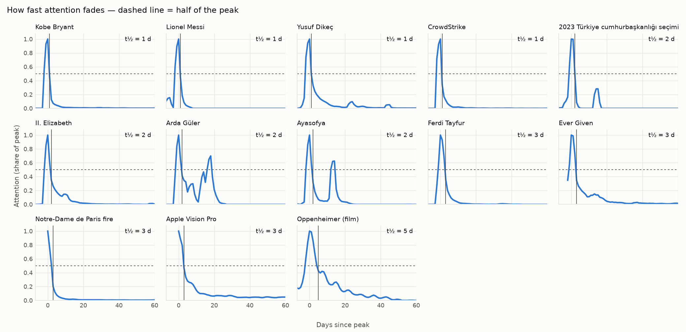
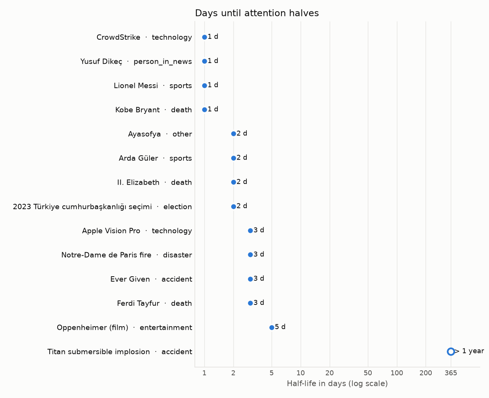

# İlginin Yarılanma Süresi — İnternet bizi ne kadar hızlı unutuyor?

Bir haber patlar, viral olur, zirveye çıkar… sonra unutulur. Bu proje, bir olaya gösterilen
kamusal ilginin **zirvedeki seviyesinin yarısına düşmesinin kaç gün sürdüğünü** ölçer.
Buna olayın *ilgi yarılanma süresi* (attention half-life) diyoruz. Ölçüm için günlük Wikipedia
sayfa görüntülenmeleri kullanılır.

> **Bulgular (15 olaylık ilk örneklem):** İnternet şaşırtıcı derecede hızlı unutuyor.
> Ölçülebilen 13 olayda ilgi **ortalama (medyan) 2 günde** yarıya indi. En hızlı unutulanlar
> (1 gün) Kobe Bryant'ın ölümü, Messi'nin Dünya Kupası finali, Yusuf Dikeç ve CrowdStrike
> kesintisiydi. En uzun süren Oppenheimer filmi oldu (5 gün); sinemalarda gösterimin sürmesi
> ilgiyi canlı tuttu. Hiçbir olayda yarılanma süresi 5 günü geçmedi.





## Yöntem

Her olay için (tek bir dildeki tek bir Wikipedia makalesi):

| Adım | Tanım |
|---|---|
| Baseline | Olaydan önceki 30 günün günlük görüntülenme medyanı (makale 7 günden yeniyse 1) |
| Fazla ilgi | `görüntülenme − baseline`, negatif değerler 0'a kırpılır, 3 günlük ortalanmış hareketli ortalama ile yumuşatılır |
| Zirve | Olay tarihinin ±7 günü içinde yumuşatılmış fazla ilginin en yüksek olduğu gün |
| **Yarılanma süresi** | Zirveden, fazla ilginin zirvenin %50'sinin altına ilk düştüğü güne kadar geçen gün sayısı |
| Sansürlü | İlgi 365 gün içinde yarıya inmediyse (`> 1 yıl` olarak gösterilir) |
| Ek ölçümler | Zirve öncesi yükseliş (olay tarihinden zirveye kaç gün), ikincil zirve sayısı (ana zirvenin %30'unu aşan sonraki tepeler), üstel ve power-law bozulma modellerinin AIC ile karşılaştırılması |

Sadece gerçek kullanıcı trafiği sayılır (`agent=user`), bot kaynaklı sıçramalar dışarıda kalır.

## Proje yapısı

```
data/events.csv        elle seçilen olaylar (başlık, dil, tarih, kategori)
data/results.csv       her olay için tüm ölçümler (script üretir)
src/fetch.py           Wikimedia Pageviews API istemcisi, yerel SQLite önbelleği ile
src/halflife.py        baseline, zirve, yarılanma süresi, bozulma modelleri
src/analyze.py         her şeyi çalıştırır, sonuçları ve grafikleri yazar
tests/test_halflife.py yarılanma süresi önceden bilinen yapay eğrilerle testler
```

## Çalıştırma

```bash
python3 -m venv venv
source venv/bin/activate          # Windows: venv\Scripts\activate
pip install -r requirements.txt

export ATTENTION_UA="attention-half-life/0.1 (GitHub: kullanici-adin)"   # Wikimedia'ya kendini tanıt
python -m src.analyze             # veriyi çek, ölç, data/results.csv ve figures/ dosyalarını yaz
python -m pytest                  # testleri çalıştır
```

Tek bir makalenin verisini çekmek için:

```bash
python -m src.fetch "2023 Kahramanmaraş depremleri" --project tr.wikipedia --start 2023-01-01 --end 2023-06-30
```

Her API yanıtı `data/cache/` altında saklanır. Böylece tekrar çalıştırmak hızlıdır ve aynı istek iki kez gönderilmez.

## Olay ekleme

`data/events.csv` dosyasına bir satır ekle. `title`, Wikipedia makale başlığıyla birebir aynı
olmalı (makalenin adres çubuğundan kopyalayabilirsin; alt çizgi ya da boşluk fark etmez).
Bulunamayan başlıklar `NOT FOUND` olarak raporlanır ve atlanır. Makale sonradan yeniden
adlandırıldıysa eski adını da `|` ile ekle: `2023 Kahramanmaraş depremleri|Eski ad`.

## Sınırlılıklar

- Wikipedia görüntülenmeleri ilginin kendisi değil, bir göstergesidir. Haberi sadece haber
  sitelerinden ya da sosyal medyadan takip edenler sayılmaz.
- Her olayı tek bir makale temsil eder. Farklı bir makale seçmek (ör. kişi sayfası yerine olay
  sayfası) sonucu değiştirebilir.
- **Yeniden adlandırılan makaleler:** Pageviews API görüntülenmeleri makalenin *o anki adına*
  göre sayar. Olay sırasında başka bir adla açılıp sonradan taşınan makalelerde ilk günlerin
  verisi eski adda kalır. Bu yüzden ilk örneklemde Kahramanmaraş depremleri (`no_peak`) ve Titan
  denizaltısı (`censored`) ölçülemedi. Çözüm: makalenin eski adını bulup `events.csv`'de
  `Yeni ad|Eski ad` şeklinde yazmak; iki adın görüntülenmeleri toplanır.
- Yarılanma süresi tam gün olarak ölçülür. Çoğu olay 1–3 günde yarıya indiği için bu
  çözünürlük kaba kalıyor; ileride saatlik veri ya da ara değerleme (interpolasyon) eklenebilir.
- Önceden beklenen olaylar (seçimler, ürün lansmanları) olay tarihinden önce yükselmeye başlar.
  ±7 günlük zirve penceresi küçük kaymaları yakalar ama uzun süren önceden yükselişleri yakalamaz.

## Arka plan

- Candia vd. (2019), *The universal decay of collective memory and attention*, Nature Human Behaviour.
- Lorenz-Spreen vd. (2019), *Accelerating dynamics of collective attention*, Nature Communications.

## Yol haritası

- [ ] Wikipedia'nın günlük en çok okunan 1000 makale listelerinden otomatik olay keşfi (`src/discover.py`)
- [ ] Wikidata ile otomatik kategorizasyon (`src/classify.py`)
- [ ] Aynı olaylar için Türkçe ve İngilizce Wikipedia karşılaştırması
- [ ] GitHub Actions ile haftalık otomatik güncelleme
- [ ] GitHub Pages üzerinde etkileşimli demo

---

**In English:** This project measures the *attention half-life* of events — how many days it takes
for public attention (daily Wikipedia pageviews) to fall to half of its peak.
